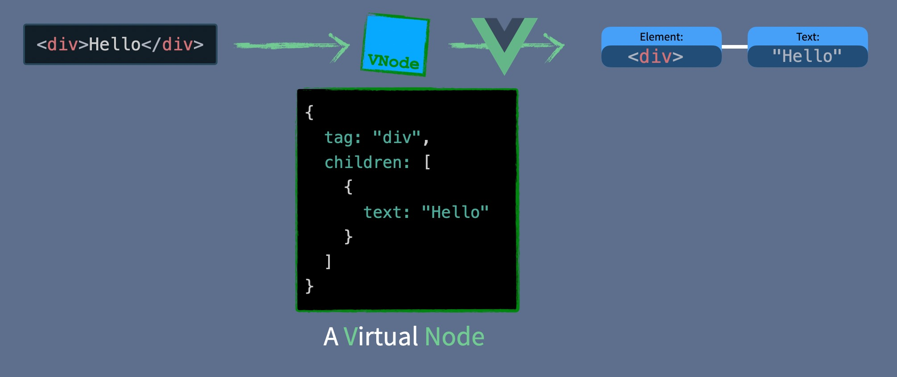
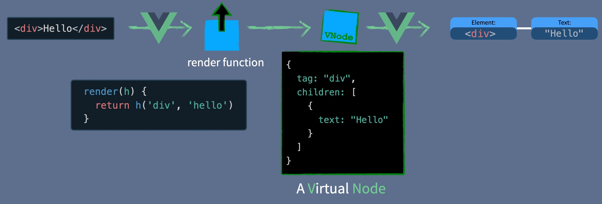
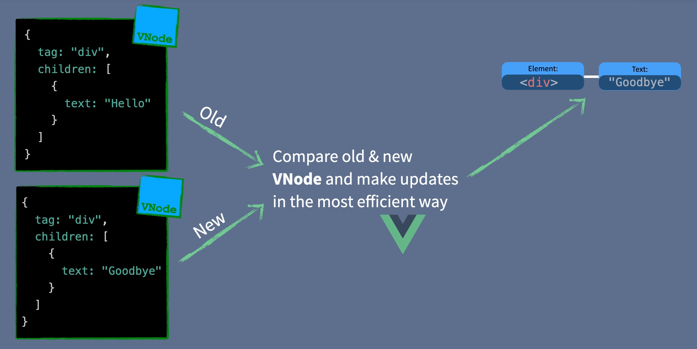

# Mini Vue Framework

this repo implements a mini vue framework aimed at learning the basic modules that makes up vue and how they work under the hood

## Virtual Dom

The Virtual DOM is a way of representing the actual DOM with JavaScript Objects.

## How Vue Works - Overview

When Vue receives a template, it compiles it into a render function.
The render function creates the virtual node, which gets sent to Vue to update the DOM. Later, if the data used by the render function changes, the render function will get run again producing a new Virtual DOM Node. Then Vue takes the old and the new node, compares the two, and makes the appropriate DOM calls to change the webpage.

## Anatomy of Vue 3

Vue 3’s core engine is made up of multiple parts.

- Reactivity Module. This allows for creating JavaScript reactive objects that can be watched for changes. When code which use these objects are run, they are tracked to be run later if the reactive object changes. If you haven’t played through my Vue 3 Reactivity course, I highly recommend you take it before moving on.

- Compiler Module. This knows how to take HTML templates and compile them into render functions. This can happen in the browser at runtime, but more often happens when a Vue project is built, so that a browser only ever receives render functions.

- Renderer Module. The renderer contains the code for 3 different phases of rendering out a component onto a webpage.
  - Render Phase. When the render function is called and returns a representation of the actual DOM called the Virtual DOM. The Virtual DOM is a JavaScript object representation of what will be rendered into the browser.
  - Mount (or Create) Phase: The renderer takes the Virtual DOM object and makes actual DOM JavaScript calls to create a webpage.
  - Patch (or Update) Phase: The renderer takes the two Virtual DOM objects, an old and a new one, and update only the parts of the webpage that have changed using DOM JavaScript calls.

taking a simple component with a template which uses a reactive object. When Vue loads up:

1. The Compiler Module changes the HTML into a render function.
2. The reactive objects are initialized by the Reactive Module.
3. The Renderer Module Render Phase invokes the render function which creates a Virtual DOM object, or VNode. Since our render function references a reactive object, we track the render function to be run again if the reactive object changes.
4. In the Mounting Phase the mount function is called, using the VNode to create the webpage.
5. When the reactive object is changed, the Patch Phase invokes the render function again, and this time calls patch with the old VNode and the new VNode, which updates only the parts of the page which have changed.
